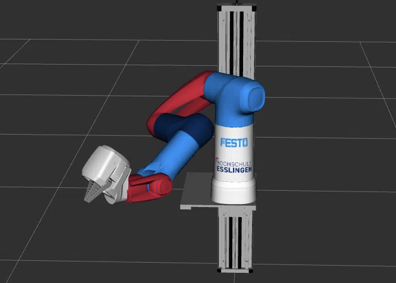

# Cobot Model

## Copyright Notice
The model was kindly provided by the company [**Festo SE & Co. KG**](https://www.festo.com/) and remains their intellectual property. Refer to their [GitHub profile](https://github.com/Festo-se) and their [website](https://www.festo.com/de/en/e/about-festo/blog/robotics-id_9229-1153/) for more information on their robotics related activities.
<br/>
<br/>
The model is adjusted based on the needs of this project. To access the original model refer commit [67d2b63d4f9a76d7f5c2ebf66c67b8af61d7ccd1](https://github.com/robgineer/artbot/commit/67d2b63d4f9a76d7f5c2ebf66c67b8af61d7ccd1).
<br/>
<br/>
License: the model (folder: *meshes* / *urdf*) is licensed under Apache-2.0. Kindly refer to the LICENSE.txt for more information.

## Model Overview

The model used represents a pneumatic arm with seven joints, indexed as: 0 - 6, and a functional gripper. <br/>

### Original Cobot Model

In its original form, the model does not contain any physics related information as *mass* or *inertia* values necessary for the simulation. These values, along with a functional gripper, have been added within the scope of this project.
<br/>


### Current Cobot Model: Esslingen

**The color scheme is a tribute to Festo SE & Co. KG, the sponsor of the Cobot, as well as to the Esslingen University, the sponsor of this project.**

Adjustments made:
* added world link
* added functional gripper
* added correct end effector model
* combined links (the original version contained several smaller links that made inertia calculations tricky)
* re-modelled several links w.r.t. their dimensions
* added collision meshes (with reduced faces)
* added realistic physical attributes for simulation (inertia and mass)
* cleaned up numerical values
* adjusted XML formatting
* changed colors of all links

The entire re-modelling (incl. all calculations) is documented in ```doc/cobot_modelling.ipynb```.



## Ergänzung

Getting Started

1. make sure that the Python Code in the Dev Container has access to the microphone of the host, to record Audio with PyAudio

Test with

*arecord -l*

if microphone works on hostsystem

the output should be something like:


**** List of CAPTURE Hardware Devices ****
card 0: PCH [HDA Intel PCH], device 0: ALC1150 Analog [ALC1150 Analog]
  Subdevices: 0/1
  Subdevice #0: subdevice #0
card 0: PCH [HDA Intel PCH], device 2: ALC1150 Alt Analog [ALC1150 Alt Analog]
  Subdevices: 1/1
  Subdevice #0: subdevice #0


2. check user groups 

*groups $USER*

the output should be something like:

ubuntu : ubuntu adm dialout cdrom floppy sudo audio dip video plugdev

if group audio is missing:

*sudo usermod -aG audio $USER*

3. edit devcontainer-configuration

in the project folder you can find the file:

.devcontainer/devcontainer.json

add the following to the runarc-block

"runArgs": [
  "--device=/dev/snd",
  "--group-add", "audio",
  "-e", "PULSE_SERVER=unix:${XDG_RUNTIME_DIR}/pulse/native",
  "-v", "${XDG_RUNTIME_DIR}/pulse/native:${XDG_RUNTIME_DIR}/pulse/native",
  "-v", "/etc/machine-id:/etc/machine-id"
]

4. Reboot devcontainer

after you save with Strg + S, reboot container with:

Strg + Shift + P

and click

Dev Container: Rebuild Container